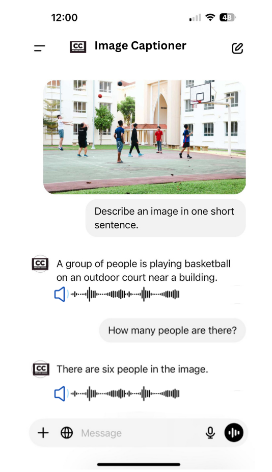
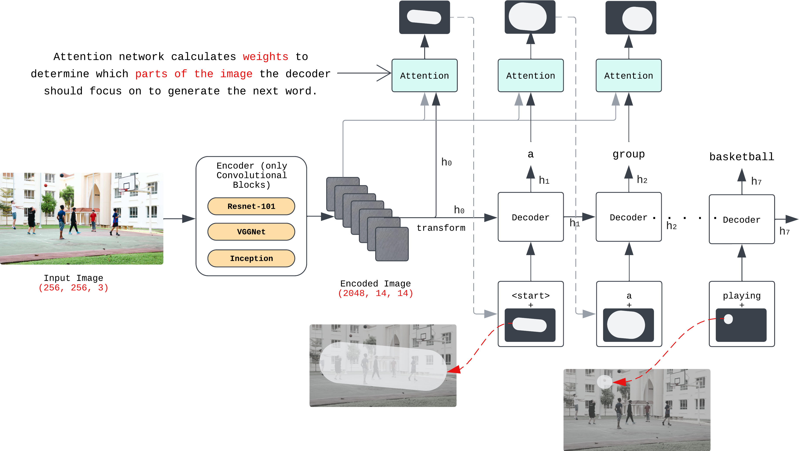
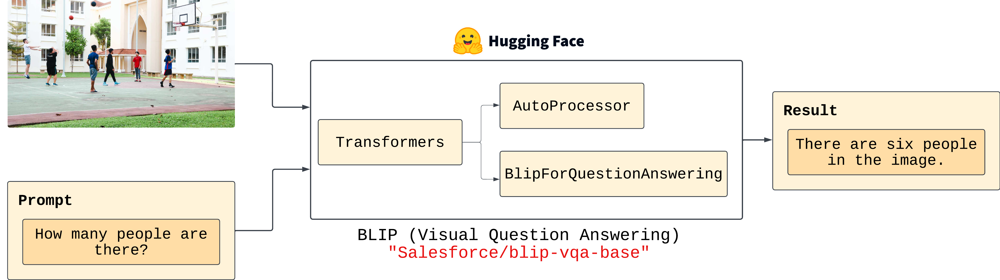
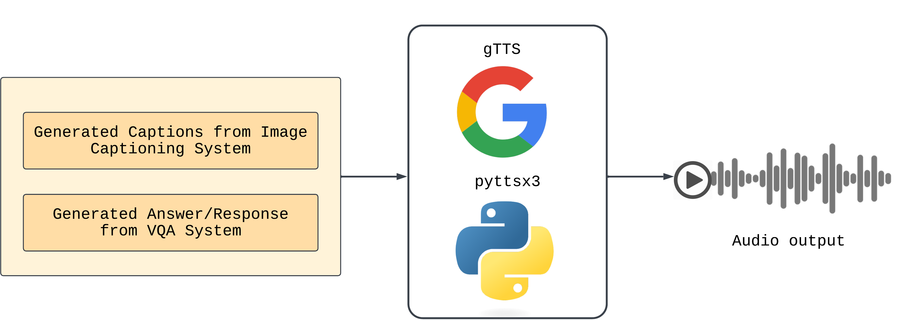

# Image Captioning Website for Visually Impaired Individuals

## Overview

  

This project develops a web-based image captioning system to enhance accessibility for visually impaired individuals. By integrating **Convolutional Neural Networks (CNN)** with **Long Short-Term Memory (LSTM)** networks, **Visual Question Answering (VQA)** using the BLIP model, and **Text-to-Speech (TTS)** functionalities, the system generates descriptive captions, answers image-related queries, and converts outputs into audio. It employs **soft attention mechanisms** to improve caption relevance and coherence, and compares feature extractors (**ResNet-101**, **VGGNet16**, **Inception-v3**) to optimize performance. The web interface, built with Flask and modern web technologies, ensures a seamless user experience.

## Project Status
The project is **under active development** and currently in the model training phase using **Google Colab Pro Plus** for high-performance GPU computation. The focus is on implementing the CNN-LSTM architecture, integrating the pre-trained BLIP model for VQA, and setting up TTS with gTTS or pyttsx3. The web application is in early development, with plans to finalize frontend and backend integration. Future steps include evaluating performance using BLEU, CIDEr, and ROUGE metrics and conducting usability testing with visually impaired users.

## Features
- **Image Captioning**: Generates contextually relevant captions using CNN-LSTM with soft attention, comparing ResNet-101, VGGNet16, and Inception-v3.
- **Visual Question Answering (VQA)**: Enables users to ask image-related questions, powered by the pre-trained BLIP model from Hugging Face.
- **Text-to-Speech (TTS)**: Converts captions and VQA answers into audio using gTTS or pyttsx3 for accessibility.
- **Web Interface**: Provides image uploads, caption and VQA answer display, and audio playback using HTML5, CSS, JavaScript, and potentially React/Vue.js.
- **Performance Evaluation**: Assesses caption quality with BLEU-4, CIDEr, and ROUGE-L metrics, plus qualitative feedback from visually impaired users.
- **Dataset Utilization**: Uses MS COCO and Flickr30k datasets with preprocessing for image normalization and caption tokenization.

### Download Datasets
- Download the **MS COCO 2017** dataset from the [official repository](https://cocodataset.org/).
- Optionally, download the **Flickr30k** dataset for supplementary testing.
- Organize datasets into a `data/` folder with subfolders for training/validation images and annotation files.

### Download Pre-trained Models
- Pre-trained CNN models (ResNet-101, VGGNet16, Inception-v3) are accessed via PyTorch’s `torchvision`.
- The BLIP model for VQA is loaded using Hugging Face’s Transformers library.

### Training the Model
- The model is currently being trained on **Google Colab Pro Plus** using the MS COCO dataset.
- Training scripts (to be added) will cover preprocessing, feature extraction, and decoder training with soft attention.

## Architecture Diagram

 
  
Figure 1 - Architecture of Image Captioning System using CNN and LSTM along with attention mechanism
  
  
Figure 2 - Simplified workflow of VQA component from BLIP Model

  
Figure 3 - Integration of a Text-to-Speech (TTS) system

## Technical Details
### Datasets
- **MS COCO 2017**: Over 120,000 images with five captions each, used for training and evaluation.
- **Flickr30k**: 31,000 images with five captions, for supplementary testing.
- Preprocessing: Resize images to 256x256, normalize pixel values, tokenize captions using NLTK.

### Feature Extraction
- Pre-trained CNNs (ResNet-101, VGGNet16, Inception-v3) extract high-dimensional feature maps.
- Fully connected layers are removed to output spatial features for attention-based decoding.

### Decoder
- LSTM-based decoder with soft attention generates captions word by word.
- Trained with teacher forcing and Cross-Entropy Loss; uses beam search for inference.

### VQA
- Uses pre-trained BLIP model (`BLIPForQuestionAnswering`) from Hugging Face.
- Processes images and tokenized questions to generate text-based answers.

### TTS
- Converts captions and VQA answers to audio using gTTS or pyttsx3.
- Integrated with the web backend for real-time audio generation.

### Web Application
- **Frontend**: HTML5, CSS, JavaScript Biblicals for embedded audio player buttons.
- **Backend**: Flask handles image processing, caption generation, VQA, and TTS.
- APIs connect frontend and backend for seamless interaction.

### Evaluation Metrics
- **BLEU-4**: Measures n-gram overlap for caption fluency.
- **CIDEr**: Evaluates semantic relevance.
- **ROUGE-L**: Assesses coverage of key information.

### Training Environment
- Training on **Google Colab Pro Plus** with GPU acceleration.
- PyTorch for model development; Hugging Face Transformers for VQA.

## Contributing
This project is in active development for internship applications. Contributions are not actively sought at this stage but may be considered later. To contribute, open an issue on GitHub to discuss proposed changes or contact the repository owner.

## License
[To be determined: Likely MIT License upon completion]

## Contact
For questions or feedback:
- Open an issue on this GitHub repository.
- Email: ugyen.tshering@student.aiu.edu.my

## Acknowledgments
- **AlBukhary International University**: For academic support and guidance.
- **Dr. Abu Bakar:** Project Advisor
- **MS COCO 2017 Teams**: For open-access datasets.
- **Hugging Face**: For the BLIP model and Transformers library.
- **Google Colab Pro Plus**: For computational resources during training.

---

*Note*: This project is actively being developed, with training on Google Colab Pro Plus. The README will be updated with milestones, including the architectural diagram, training scripts, and detailed setup instructions.
